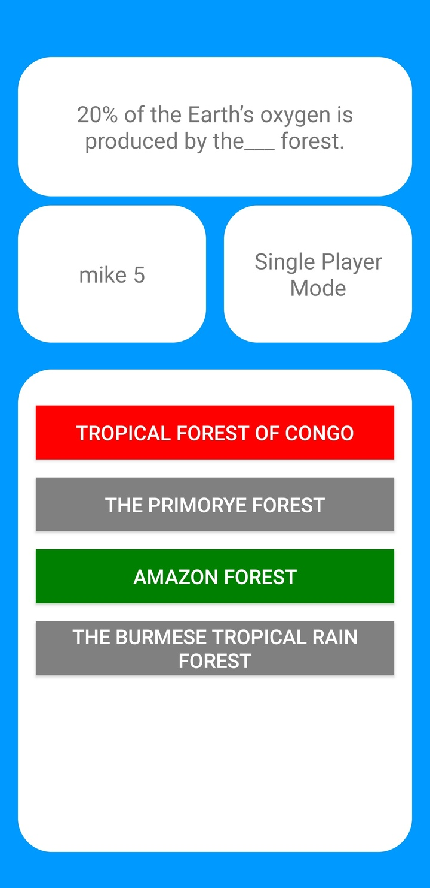

# Trivia With Friends

Project for SFU CMPT 276 - Introduction to Software Engineering.  

Readme Links:
- [Project Dependencies](#project-dependencies)
- [Known Bugs](#known-bugs)
- [Contributors](#contributors)

# Project Overview

Pictures of some parts of the UI shown below:   
***Click on the arrow to expand the image***

  
Main Menu

  

  
Correct answer

  

  
Incorrect Answer

  

  
Elo Graph

  

  
Friends List

  

# Project Dependencies

- Android Studio IDE and Java to create the application
- [Realm](https://realm.io/) and [MongoDB](https://www.mongodb.com/) for our database solution
- [HXAudioPlayer](https://github.com/huhx0015/HXAudioPlayer) for handling game music and sounds
- [Hello Charts](https://github.com/lecho/hellocharts-android) for graphing users' elo change
- [Scaledrone API](https://www.scaledrone.com/) for creating global and friend chat rooms

> Using free version of MongoDB and Scaledrone - As a result speed may be impacted and only 20 unique chat keys can be generated. 

# Known bugs

- Realm database can occasionally cause crashes for an unknown reason
  - Working on identifying the problem, seems to only occur on physical devices not emulators
  - Occurs when app is closed and reopened after the OS clears the ram memory used by the app
- Multiplayer only works if two users start a Singleplayer game at the same time
  - Working on lobby system to allow an easier experience of playing with a friend
- Making changes to the MongoDB schema will break the app until it is re-installed
  - If app is released to the play store, this would not be an issue as we would require the user to install an update

# Contributors

- [Mike Ostrowka](https://github.com/Mike-Ostrowka)
  - Product owner
  - Realm Database
  - Login/ Logout
  - Friends List
  - Settings
- [Tanner Langan](https://github.com/tannerlangan)
  - Repo Manager
  - Game logic
  - Single Player Mode
  - Multiplayer Mode
- [Jaden Yu](https://github.com/jadenyu)
  - Developer
  - UI
- [Randy Gill](https://github.com/randyg92)
  - Scrum Master
  - Chat
  - Graphs
  - User profile
  - Password hashing
